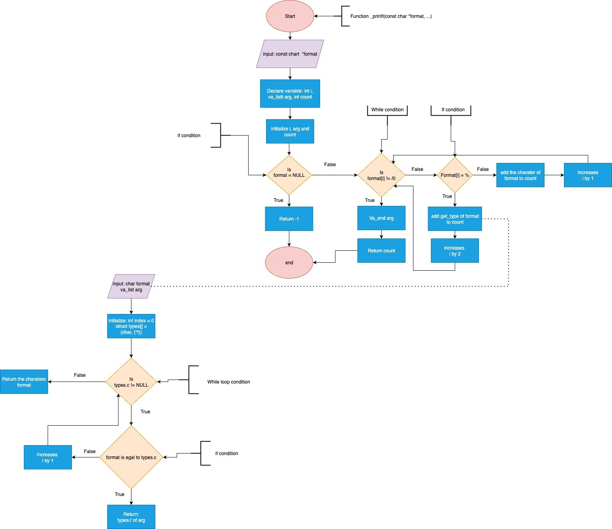

# Holberton project: _printf

## About
### Description
`_printf` is our first group project at Holberton School.<br/>
Its goal is to recreate as much of the pre-existing `printf` standard library function as possible, with a MVP set to recognise the conversion specifiers `c`, `s`, `i` and `d`.<br/>
Through this project we learned to use GitFlow, create flowcharts, write technical documentation, and ensure our code is clean and easy to understand.<br/>
Our function `print_f`, like the original, is a _variadic function_ that takes a constant character string and zero or more arguments.<br/>
Its **prototype** is as follows:<br/>
`int _printf(const char *format, ...);`<br/>
As _printf uses the `write` function to print to standard output, the expected return value is the number of printed characters or `-1` in the case of input error.<br/>
#### Compilation command:<br/>
```
gcc -Wall -Werror -Wextra -pedantic -std=gnu89 -Wno-format *.c main.h
```
The options given above ensure that our code is compatible with as many machines and environments as possible thanks to `-std=gnu89`, and has strict adherence to ISO C and C++ (`-pedantic`).<br/>The option `-Wno-format` removes from `-Wall` the possibility to warn about incompatibility between arguments and the conversion specifiers supposed to relate to them.<br/>

### Requirements
* files must be compiled with aforementioned options on Ubuntu 20.04 LTS
* all files must be Betty compliant
* an include-guarded main.h file will contain all function prototypes
* README file must be included at the root of the repo
* no more than 5 functions per file and no global variables
* only one project repo per group
* limited to functions write, malloc, free, and macros wa_start/end/copy/arg
* output must be written on standard output stream
* function returns the number of characters that were printed, terminating null byte excluded

### Man page
The man page, once compiled with gzip and added to the usr/share/man/man3 directory, can be invoked with the command:<br/>
`man ./man_3_printf`<br/>

### Flowchart


## Uses and tests
Beyond the straightforward uses such as a simple string, a small integer, or any regular mixes of the two (e.g. `My dog's name is %s and she's %i years old`), we wanted to test more unexpected cases so that our four main specifiers would work as well as possible.<br/>

#### Min_int
One such test was to input the minimum value an integer type can contain and compare _our_ function's output to _standard_ printf's:<br/>
```
_printf("Min_int : %d\n", -2147483648);
printf("Min_int : %d\n", -2147483648);
```
Gave us the following output:<br/>

```
Min_int : -
Min_int : -2147483648
```
This issue was fixed by changing `int n` of our `print_int` function into a long integer.

#### More percent & More unknown
Should the user decide to pass a string of `%` as `*format`, we had to ensure our function would print the right amount.<br/>
It was initially not the case, with our output missing one out of the five final `%` given by standard printf.<br/>
At the same time, if the letter behind `%` isn't a known conversion specifier, we wanted to print it in the same way standard printf does.</br>
At first, the comparison wasn't to our advantage:<br/>
```
More unknown [r%rr]
More unknown [%r%r%r]
```

These two issues were fixed by changing lines in our `_printf.c` file into the following:


Wherein the `while` loop used to be a `for` loop, and no `else` condition was set, therefore incrementing our `i` variable one time too many.<br/>
The `else` condition ensures we print whatever comes after the percent character, should no conversion specifier come right behind it.<br/>
Now, this test:<br/>
```
_printf("More percent : [%%%%%%%%%%]\n");
printf("More percent : [%%%%%%%%%%]\n");
```
outputs the following:<br/>
```
More percent : [%%%%%]
More percent : [%%%%%]
```
And this one:<br/>
```
_printf("More unknown [%r%r%r]\n");
printf("More unknown [%r%r%r]\n");
```
gives the following output:
```
More unknown [%r%r%r]
More unknown [%r%r%r]
```
**NB:** Depending on the OS, the above output might differ.<br/>

#### Valgrind
Because no test is truly complete without it!<br/>

